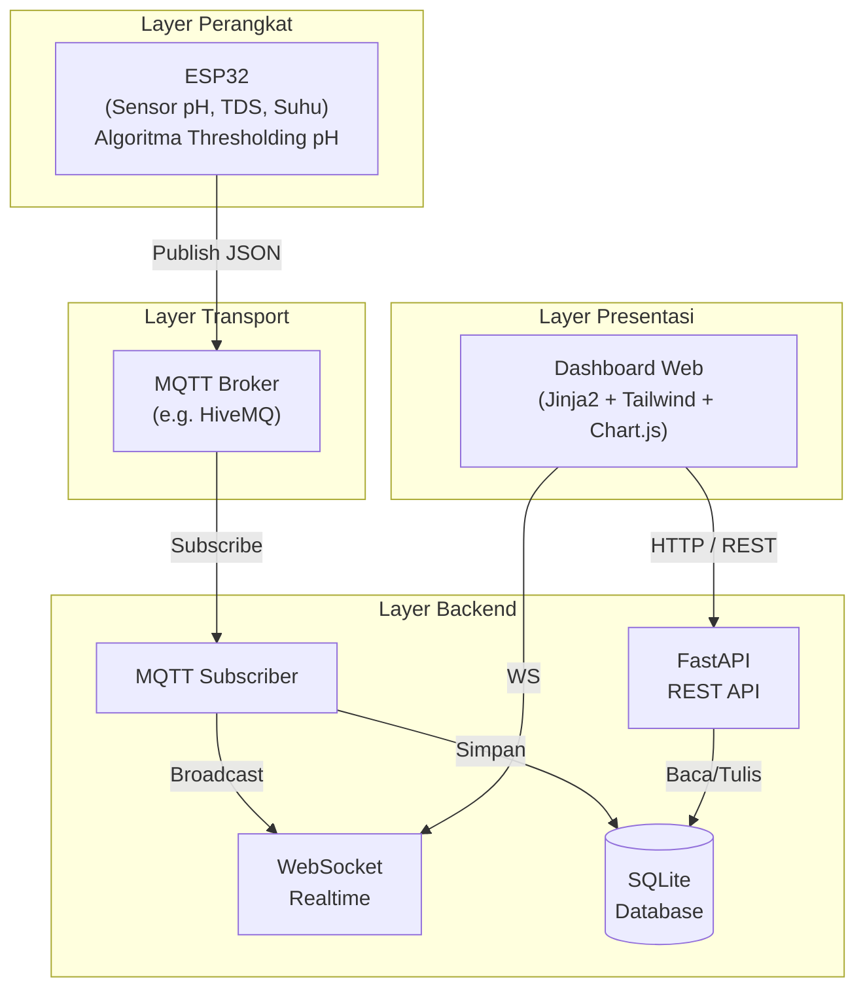
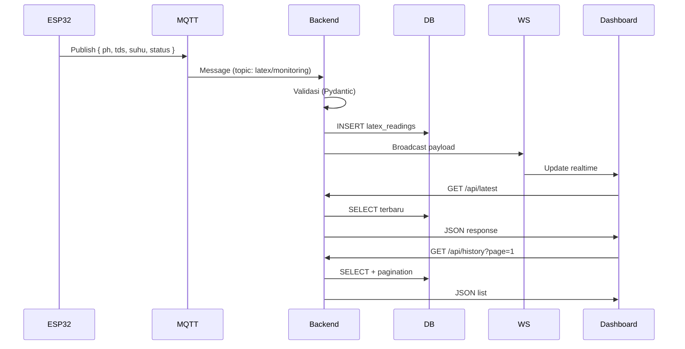
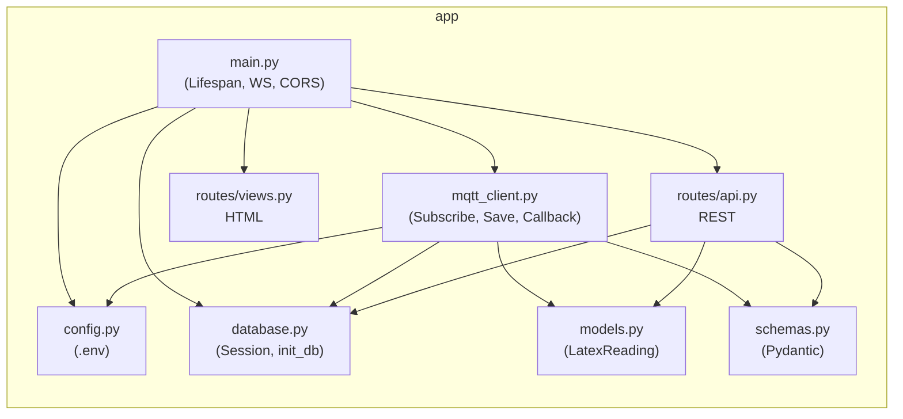

# Arsitektur Sistem - Latex Smart Monitoring

Diagram berikut dapat digunakan untuk Bab 3 Skripsi (Rancang Bangun Sistem).

## Diagram Arsitektur Umum

## Alur Data (Sequence)

## Struktur Modul Backend

## Tabel Database

| Kolom      | Tipe     | Keterangan        |
|-----------|----------|-------------------|
| id        | INTEGER  | Primary key       |
| ph        | FLOAT    | Nilai pH (0–14)   |
| tds       | FLOAT    | TDS (ppm)         |
| suhu      | FLOAT    | Suhu (°C)         |
| status    | VARCHAR  | Mutu (Prima/Sedang/Buruk) |
| created_at| DATETIME | Waktu pencatatan  |

---

*Dokumen pendukung untuk skripsi: Rancang Bangun Sistem Deteksi Mutu Lateks Portabel Berbasis IoT.*
